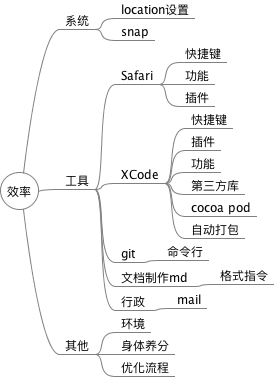
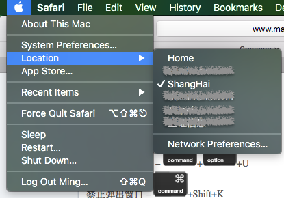
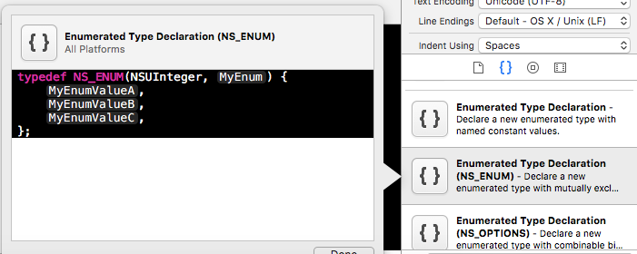
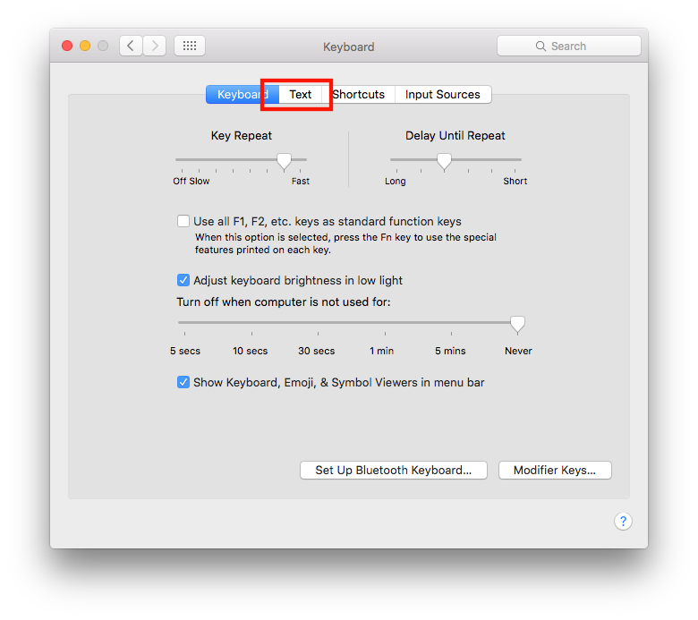
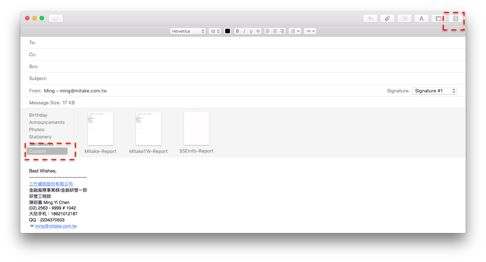

# iOS 工程师工作效率汇整

## 目录

* [概述](#概述)
* [系统](#系统)
* [工具](#工具)
* [其他](#其他)
* [总结](#总结)
* [参考](#参考)

  

## 概述

从事IT工作至今，工程师至PM的工作经历中，工作的效率成为首要的工作，一个人的效率与平常生活养成有关：

* 阅读速度，有些人快，一分钟千字以上，有些人则不及。
* 如打字速率与写作文章，有些人行云流水，有些人字字辛苦。

所以做相同的事情，有些人快，有些人慢，同样上班八小时，却有不同的产值。***产值*** 与个人价值息息相关。

写这篇文章归纳能提升效率的作法，然而习惯成自然。减少做事所花的时间，增加自己的产值，增加自己的工作能力...等等。假若一个人可以提升 10% ，公司内部工程师有 10个人，公司就可以 ***增加一个人的产值*** 。

由于我是 iOS 工程师，我分享 Mac 相关提升效率方式。

以下分为`系统、工具、其他`三类类，叙述如下。

## 系统

* 系统快速键：由于过于基本所以不再此提及。
	* location设置：
	* 带著电脑到处跑的同学可以用location的方式快速切换网络连线。
	
	 
* [snap](https://itunes.apple.com/cn/app/snap/id418073146?mt=12)：主要快速切换Mac的app；小提示，不要与常用的软件快速键冲突。

## 工具

* **safari**
	* 快速键(版本的关系会有些差异，所以找到自己的系统的快速键)
	
	| 快捷键                                 | 功能                         | 
	|---------------------|---------
	| 下一个标签页              | Control+Tab       |
	| 下一个标签页              | Control+Shift+右       | 
	| 上一个标签页              | Control+Shift+左 | 
	| 显示阅读列表              | Command+Shift+L   | 
	| 当前页面加入到Reading List | Command-Shift-D   |
	| 在阅读器中阅读             | 加入自选     | command+D| Command+Shift+R   |
	| 向下滚动一屏              | 空格                |
	| 向上滚动一屏              | Shift+空格          |
	| Shift + urlLink     | add reading list  |
	| (上/下)页     | command+(左/右)|
	
	* 插件
		* [JSON Formatter](https://github.com/rfletcher/safari-json-formatter)
		* [keySearch](http://www.macosxtips.co.uk/keysearch/)
		* [evernote](https://www.yinxiang.com/webclipper/?downloaded)
		
* **XCode**：
	* **快速键**
	
	| 快捷键                                 | 功能                         | 
	|-------------------------------------|----------------------------| 
	| Command + Option + [ 或 ]            | 当前行上下移动                    | 
	| Command + Option + Left/Right       | 折叠、展开当前代码段                 | 
	| Command + Control + Up/Down .h 和 .m | 文件切换                       | 
	| Command + Control + Left/Right      | 浏览历史切换                     | 
	| Command + Control + y               | 运行期间，继续运行                  | 
	| Comannd + Shift + o                 | 文件搜索                       | 
	| Comannd + Shift + f                 | 全局搜索                       | 
	| Command + Shift + [ 或 ]             | 左右切换 tab                   | 
	| Command + shift + ,                 | 编辑 scheme                  | 
	| Command + Shift + Y                 | 显示/隐藏调试区                   | 
	| Command + Shift + J                 | 可展示当前你在工程导航器中打开的文件         | 
	| Command + Alt + 0                   | 显示/关闭工具区                   | 
	| Command + Alt + Enter               | 打开Assistant editor         | 
	| Command + Alt + Shift +  Enter      | 打开版本控制编辑器                  | 
	| Command + [ 或 ]                     | 左右缩进                       | 
	| Command + 0                         | 显示/隐藏导航区                   | 
	| Command + Enter                     | 显示标准单窗口编辑器                 | 
	| Command + k                         | 删除 Console 中的内容            | 
	| Command + .                         | 方便地暂停运行iOS模拟器              | 
	| Control + i                         | 文字缩进格式化                    | 
	| Control + 1~ 6                      | 在Jump bar的不同标签页的跳转。        | 
	| F6                                  | 运行跳到下一条指令                  | 
	| F7                                  | 运行跳进下一条指令（它会跳进内部函数，具体效果自测） | 
	
	* **建立常用代码**	
		 
	* **插件**
		1. [VVDocumente](https://github.com/onevcat/VVDocumenter-Xcode)：備註
		2. [KSImageNamed-Xcode](https://github.com/ksuther/KSImageNamed-Xcode)：图片
		3. [JDPluginManager](https://github.com/jaydee3/JDPluginManager)：管理 XCode Plug in
		4. [SCXcodeSwitchExpander](https://github.com/stefanceriu/SCXcodeSwitchExpander)：switch case 自动生成。
		5. [XcodeBoost](https://github.com/fortinmike/XcodeBoost)：可以通过在.m文件中拷贝方法，粘贴进.h文件的时候就可以得到自动格式成的方法声明
		 
	* **第三方库**：汇整相关好用第三方库，以便不时之需。
		* [个人常用iOS第三方库以及XCode插件介绍](http://www.cocoachina.com/ios/20150710/12503.html)
		* [几个提高 iOS 开发效率的开源类库及工具](http://www.cocoachina.com/ios/20101122/2375.html)
	* **cocapods**：管理第三方库
	* **[自动包版](http://www.cocoachina.com/cms/wap.php?action=article&id=16811)**
	
	
* **Git**:
	* 正在整理常用的 git 指令中

* **markdown**：
	* [mou/macdown](http://www.jianshu.com/p/6c157af09e84)
	* [常用格式符号](http://daringfireball.net/projects/markdown/syntax)
	* [csv快速转md的table格式](https://donatstudios.com/CsvToMarkdownTable)
	* [Tables Generator](http://www.tablesgenerator.com)
	* 快速产生目录结构 tree ：
		1. 首先安装 [homebrew](http://brew.sh)
		2. 命令行 brew install tree
		3. 命令行 tree，该目录结构一目了然。
		
		~~~
		├── README.md
		├── images
		│   ├── code.png
		│   ├── keyboardquickly.png
		│   ├── locations.png
		│   ├── mailform.png
		│   └── tree.png
		└── mindmap.mm	
		~~~
	

* **mail**
	* 建立group通讯录		
	* 建立常用字句
		 
	*  建立mail模版
		 	
	

## 其他

* **环境**
	* 「勿扰模式」，规定时间内不受打扰，完整处理时间。(在Asana，星期三没有任何会议的。)。
	* 「讨论时间」，每天早上会议，会议内容主要「昨日完成、今日预计完成、问题讨论」。
* **身体养分**
	* 运动、冥想[自控力-有提及](http://item.jd.com/11017970.html)、水、营养。
* **优化流程**
	* 固定流程的可以建立一定的模式，周报email建立联络人、发信模版；利用命令行，app包版流程。

## 总结

>效率的提升，要减少持滑鼠的次数，以减少手部移动的时间，以加快工作的效率。

>如「[当幸福来敲门](http://www.imdb.com/title/tt0454921/)」主角，为了提升效率，上班减少喝水为的只是减少上厕所的次数；打电话给客户，话筒不挂上，当然不用作的如此夸张。

>如「[神奇眼脑直映快速法](https://www.amazon.cn/神奇的眼脑直映快读法-胡雅茹/dp/B00KAT0P7O/ref=pd_cp_351_3?ie=UTF8&psc=1&refRID=46BA06SNMT7V4DAF2R1D)」，训练眼球的阅读速度，不移动头部以增加速率。

>基本上上班除了敲键盘与少量的动动滑鼠，可以达到最好的效能。
接下来的两个目标，记忆与实用、融入成为潜意识，达到快捷的效率。

//TODO 汇整 git 常用指令集

## 参考

* [提高mac开发效率](https://bestswifter.com/efficient-mac/#more)
* [来自不同行业的一些高效开发技巧](http://www.cocoachina.com/cms/wap.php?action=article&id=16836)
* [让您的Xcode键字如飞](http://www.cocoachina.com/cms/wap.php?action=article&id=16989)
* [Cocoapods](http://www.cocoachina.com/cms/wap.php?action=article&id=16742)
* [iOS自动化打包](http://www.cocoachina.com/cms/wap.php?action=article&id=16811)
* [10款Safari for Mac扩展插件推荐](http://sspai.com/25148)
* [提高iOS开发效率的方法和工具](http://www.cocoachina.com/ios/20150717/12626.html)
* [17个提升iOS开发效率的必用工具](http://www.cocoachina.com/ios/20151110/14102.html)
* [Git学习笔记](http://m.blog.csdn.net/article/details?id=51781629) 
* [30分钟Git命令入门到放弃](http://www.codeceo.com/article/git-30-miniute.html)
* [10步成为专业iOS开发者——从零起步](http://www.cocoachina.com/ios/20150617/12165.html)
* [Mac下提升工作效率的方式](http://www.codeceo.com/article/improve-effective-in-mac.html)
* [写给iOS程序员的命令行使用秘籍](http://www.codeceo.com/article/ios-programmer-command.html)